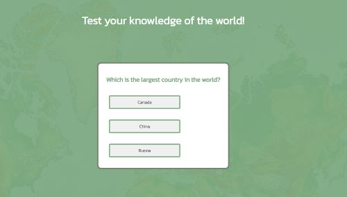
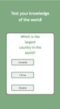
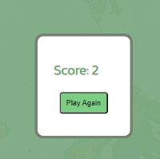

# Geography Quiz

Geography quiz is a quiz page built with JavaScript. The page is for people who want to test their knowledge of the world we live in and maybe learn something new at the same time.

  

## Features

### Quiz area

The page has a simple build. It has a quiz area that show up immediatly when you open the web page. There is a question followed by 3 buttons giving the user 3 different alternative answer. If the user picks the right answer the button will turn green. If the user picks the wrong answer the button will turn red and the button with the right answer will turn green. 

### Score function

When the user has answered all questions a calculated score will show in the quiz area and the user is given the alternative to take the quiz again.

### Features Left to Implement

It would have been nice to have a pop up area with some information about the right answer as well as pictures. A high score function would also be a nice asset. The quiz could also use  more questions to keep the quiz interesting.

## Testing

I have tested both correct and incorrect answers in the quiz, next button and "play again"-function.
I have gone through all the different ipad and phone types in google inspect and made adjustments.

### Validator Testing

- HTML
  - No errors were returned when passing through the official [W3C validator](https://validator.w3.org/)
- CSS
  - No errors were found when passing through the official [(Jigsaw) validator](https://jigsaw.w3.org/css-validator/validator)
- JavaScript
  - No errors were found when passing through the official [Jshint validator](https://jshint.com/)
    - The following metrics were returned:
    - There are 9 functions in this file.
    - Function with the largest signature take 1 arguments, while the median is 0.
    - Largest function has 8 statements in it, while the median is 4.
    - The most complex function has a cyclomatic complexity value of 2 while the median is 2.

## Deployment

This section should describe the process you went through to deploy the project to a hosting platform (e.g. GitHub)

- The site was deployed to GitHub pages. The steps to deploy are as follows:
  - In the GitHub repository, navigate to the Settings tab
  - From the source section drop-down menu, select the Main Branch
  - Once the master branch has been selected, the page will be automatically refreshed with a detailed ribbon display to indicate the successful deployment.

The live link can be found here - https://elisabethkandersson.github.io/Portfolio_2/

## Credits

I looked through several quiz tutorals before building this page. I wanted to make a quiz with buttons and had already built the html like that. I found one that covered the functions I needed and used that to help build the javascript functions: <https://www.youtube.com/watch?v=PBcqGxrr9g8>.

Due to illness and doctors appoinments in the beginning of the project for me, I ended up working very intensly at the end and at strange hours. Therefore I was only able to schedule 1 start up meeting with my mentor, Jubril Akolade. He gave me some good start up advice. It would have been good to have the remaining two mentor sessions too.

### Content

I verified the answers in the quiz from many different sources to make sure I got the right answer after having used google to check for answers.

I used the Kanit font from Google fonts.

I used this sevice to create a color palette that worked with my vision: <https://coolors.co/bac7be-80ab82-7dcd85-778472>

### Media

I used a background image of a world map from pixaby.com
